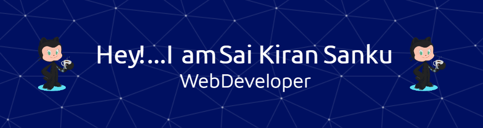

### Hi there 👋

<!--
**Sai-Kiran-Sanku/sai-kiran-sanku** is a ✨ _special_ ✨ repository because its `README.md` (this file) appears on your GitHub profile.

Here are some ideas to get you started:

- 🔭 I’m currently working on ...
- 🌱 I’m currently learning ...
- 👯 I’m looking to collaborate on ...
- 🤔 I’m looking for help with ...
- 💬 Ask me about ...
- 📫 How to reach me: ...
- 😄 Pronouns: ...
- ⚡ Fun fact: ...
-->

# Sai Kiran Sanku

## About Me

A brief introduction about yourself.

## Contact Information

- [GitHub](https://github.com/sai-kiran-sanku)
- saikiran4jobs@gmail.com
- [LinkedIn](https://www.linkedin.com/in/sai-kiran-sanku/)

## Skills

- Web Development
- Data Analysis
## Tools

## Projects

- Project 1: [Project Name](Link to Project Repository)
- Project 2: [Project Name](Link to Project Repository)
- ...

## Open Source Contributions

- Contribution 1: [Repository](Link to Repository)
- Contribution 2: [Repository](Link to Repository)
- ...

## Blog Posts

- [Title of Blog Post](Link to Blog Post)
- [Title of Blog Post](Link to Blog Post)
- ...

## Fun Facts

- Fun fact 1
- Fun fact 2
- ...
